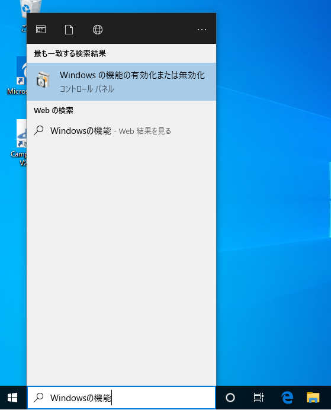
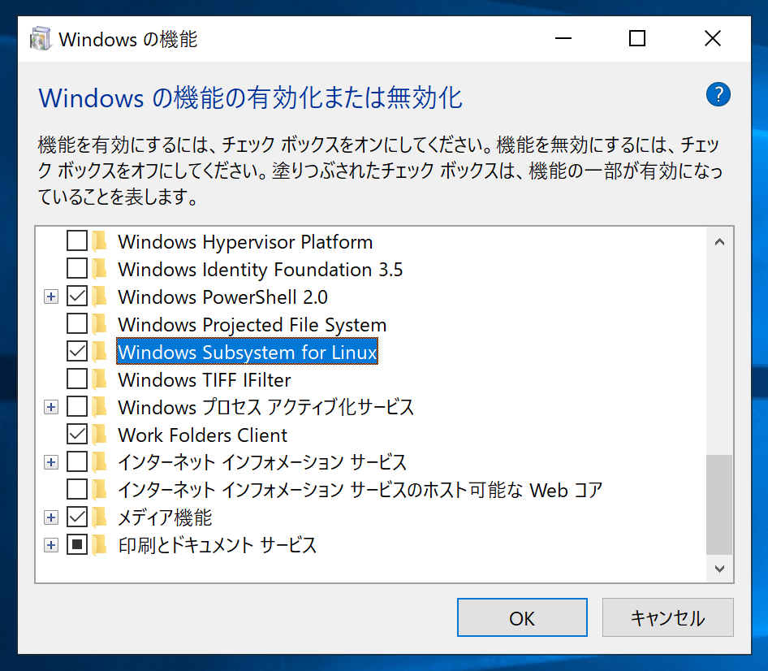
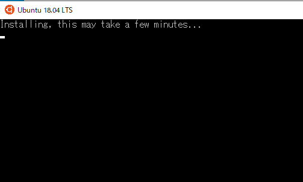
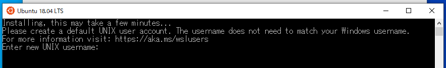

# Windows Subsystem for Linux（WSL）を使ったシェル芸環境の構築

2020年3月28日作成

まず、「Windowsの機能の有効化または無効化」を立ち上げます。

項目の中から、「Windows Subsystem for Linux」を見つけ、チェックを入れます。

再起動ののち、「Microsoft Store」を開き、「Ubuntu 18.04 LTS」をインストールします。

つぎの通知か、左下の検索窓に「Ubuntu」と打ち込んで、Ubuntuを起動します。

起動すると、つぎのように少し待つように指示があります。

その後、パスワードを設定するように言われるので設定します。

